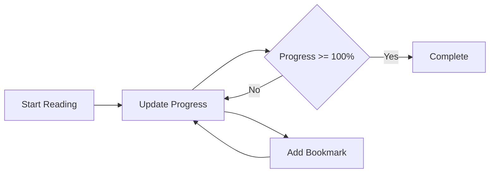

# Smart Library System - Dokumentasi Sistem Perpustakaan Digital Modern

## Daftar Isi
1. [Pengenalan](#1-pengenalan)
2. [Arsitektur Sistem](#2-arsitektur-sistem)
3. [Komponen Utama](#3-komponen-utama)
4. [Fitur Inovatif](#4-fitur-inovatif)
5. [Implementasi Kode](#5-implementasi-kode)
6. [Contoh Penggunaan](#6-contoh-penggunaan)
7. [Best Practices](#7-best-practices)

## 1. Pengenalan

Smart Library System adalah sistem perpustakaan digital modern yang menggabungkan berbagai teknologi canggih seperti blockchain, analisis sentiment, dan sistem rekomendasi. Sistem ini dirancang dengan mempertimbangkan aspek:
- Skalabilitas
- Keamanan
- Kemudahan penggunaan
- Fleksibilitas
- Performa

## 2. Arsitektur Sistem

### 2.1 Layer Sistem
```
┌─────────────────────────┐
│    Presentation Layer   │
│  (User Interface/API)   │
├─────────────────────────┤
│    Business Layer       │
│  (Smart Library Core)   │
├─────────────────────────┤
│    Data Layer          │
│  (Content & Users)      │
└─────────────────────────┘
```

### 2.2 Komponen Arsitektur
- **Frontend**: Interface pengguna
- **Backend**: Sistem manajemen konten
- **Storage**: Sistem penyimpanan konten digital
- **Blockchain**: Sistem peminjaman berbasis smart contract
- **Analytics**: Sistem analisis dan rekomendasi

## 3. Komponen Utama

### 3.1 Mixins
```python
class SentimentAnalysisMixin:
    def analyze_sentiment(self, text: str) -> float:
        # Implementasi analisis sentiment
        pass

class ProgressTrackingMixin:
    def update_progress(self, page: int, total_pages: int):
        # Implementasi tracking progress
        pass
```

### 3.2 Abstract Base Classes
```python
class Content(ABC):
    @abstractmethod
    def get_type(self) -> str:
        pass

class NotificationChannel(ABC):
    @abstractmethod
    def send_notification(self, user: 'User', message: str):
        pass
```

### 3.3 Smart Contract
```python
class LoanSmartContract:
    def __init__(self, content: Content, user: 'User', duration: int):
        self.contract_hash = self._generate_contract_hash()
        
    def _generate_contract_hash(self) -> str:
        # Implementasi hash generation
        pass
```

## 4. Fitur Inovatif

### 4.1 Sistem Blockchain Sederhana
- **Hash Generation**: Menggunakan SHA-256
- **Smart Contracts**: Kontrak peminjaman digital
- **Verifikasi**: Sistem verifikasi otomatis

### 4.2 Analisis Sentiment
```python
def analyze_sentiment(self, text: str) -> float:
    positive_words = ['bagus', 'suka', 'baik', 'hebat', 'recommended']
    negative_words = ['buruk', 'jelek', 'kecewa', 'bosan', 'rumit']
    
    words = text.lower().split()
    sentiment_score = 0
    
    for word in words:
        if word in positive_words:
            sentiment_score += 1
        elif word in negative_words:
            sentiment_score -= 1
            
    return sentiment_score / max(len(words), 1)
```

### 4.3 Sistem Tracking Progress


## 5. Implementasi Kode

### 5.1 Sistem Notifikasi Multi-Channel
```python
class EmailNotification(NotificationChannel):
    def send_notification(self, user: 'User', message: str):
        print(f"Sending email to {user.email}: {message}")

class PushNotification(NotificationChannel):
    def send_notification(self, user: 'User', message: str):
        print(f"Sending push notification to {user.device_id}: {message}")
```

### 5.2 Sistem Rekomendasi
```python
class RecommendationEngine(Generic[T]):
    def __init__(self):
        self.content_pool: list[T] = []
    
    def get_recommendations(self, user: User, count: int = 5) -> list[T]:
        # Implementasi algoritma rekomendasi
        return self.content_pool[:count]
```

### 5.3 Manajemen Konten
```python
class EBook(Content, ProgressTrackingMixin):
    __slots__ = ['format', 'size', 'total_pages', '_progress', '_bookmarks']
    
    def __init__(self, title: str, author: str, format: str, size: int, total_pages: int):
        Content.__init__(self, title, author)
        ProgressTrackingMixin.__init__(self)
```

## 6. Contoh Penggunaan

### 6.1 Inisialisasi Sistem
```python
# Buat instance perpustakaan
library = SmartLibrary()

# Daftarkan pengguna
user = User("U001", "John Doe", "john@example.com", "DEVICE001")
library.register_user(user)

# Tambah konten
ebook = EBook("Python Advanced", "Jane Smith", "PDF", 1024, 300)
library.add_content(ebook)
```

### 6.2 Proses Peminjaman
```python
# Pinjam buku
loan_contract = library.process_loan(user.id, ebook._hash, 14)

# Update progress
ebook.update_progress(50, 300)
ebook.add_bookmark(50, "Bagian penting")

# Tambah review
review = user.add_review(ebook, "Buku ini sangat bagus")
```

## 7. Best Practices

### 7.1 Penggunaan Type Hints
```python
from typing import TypeVar, Generic, List

T = TypeVar('T')

def get_recommendations(self, user: User) -> List[T]:
    pass
```

### 7.2 Memory Optimization
- Penggunaan `__slots__`
- Lazy loading untuk konten besar
- Caching untuk rekomendasi

### 7.3 Security Best Practices
1. Hashing untuk contract verification
2. Enkripsi data sensitif
3. Validasi input
4. Rate limiting
5. Access control

### 7.4 Performa
1. Penggunaan generic types
2. Optimasi memory dengan slots
3. Efficient data structures
4. Caching strategy

## Kesimpulan

Smart Library System menunjukkan implementasi modern dari sistem perpustakaan digital dengan:

1. **Inovasi Teknologi**
   - Blockchain
   - Machine Learning (Sentiment Analysis)
   - Smart Contracts

2. **Best Practices**
   - Clean Code
   - SOLID Principles
   - Type Safety
   - Memory Optimization

3. **Fitur Canggih**
   - Multi-channel Notifications
   - Progress Tracking
   - Recommendation System
   - Digital Rights Management

4. **Skalabilitas**
   - Modular Design
   - Extensible Architecture
   - Generic Programming

Sistem ini dapat dikembangkan lebih lanjut dengan menambahkan:
1. Integrasi dengan blockchain yang lebih kompleks
2. Algoritma rekomendasi yang lebih canggih
3. Sistem DRM yang lebih robust
4. Analytics dan reporting yang lebih detail

